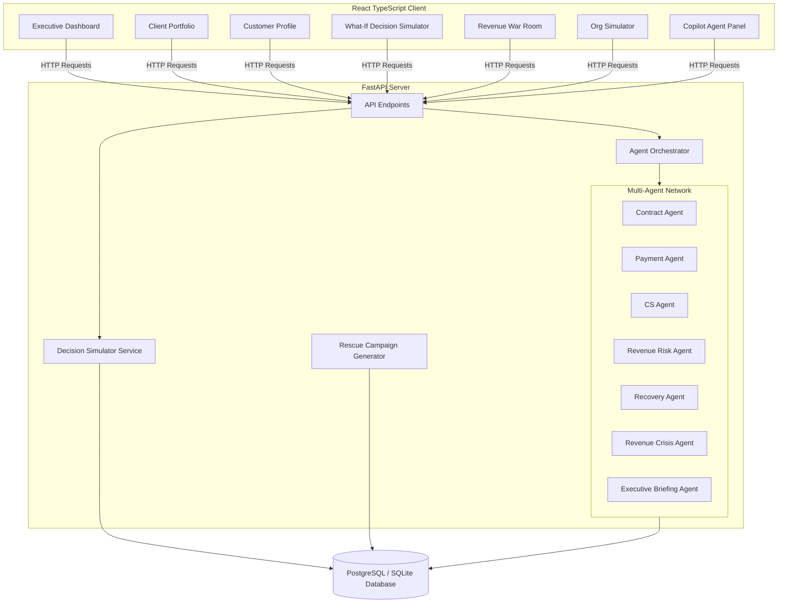
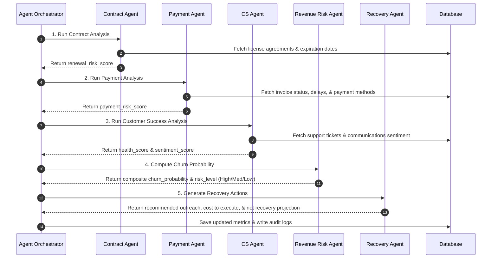

# ReviveIQ Platform Architecture & Workflow

ReviveIQ is an autonomous AI-driven Revenue Recovery Agent system designed to protect Microsoft 365 Copilot enterprise accounts from churn. This document outlines how the backend AI agents, database engine, and frontend interactive components work together to detect, simulate, and recover at-risk revenue.

---

## 1. System Architecture Overview

---

## 2. Backend Intelligence Pipeline (Agent Orchestration)

When a portfolio synchronization is triggered, or when a user clicks **Sync Risk Metrics** on a customer's profile, the backend `AgentOrchestrator` runs a sequential multi-agent analysis in logical dependency order:

### Detailed Agent Responsibilities:
1. **Contract Agent:** Inspects license volumes, end dates, and contract terms to determine commitment risks.
2. **Payment Agent:** Evaluates overdue bills and predicts payment delay ranges.
3. **CS Agent:** Leverages NLP semantic clustering to group support tickets (e.g., tagging Azure SSO loops) and scores communication sentiment.
4. **Revenue Risk Agent:** Synthesizes outputs from steps 1-3 to compute overall `churn_probability`, `revenue_at_risk`, and writes the narrative **AI Explainability Evidence**.
5. **Recovery Agent:** Generates concrete mitigation packages (e.g., license discounts, engineering support escalations) containing precise financial projections.
6. **Executive Briefing Agent:** Compiles portfolio-wide metrics and drafts a text-based, C-suite narrative summarizing organizational health and major risk exposures.
7. **Revenue Crisis Agent:** Identifies systemic triggers (e.g. workspace-wide authentication drops) that impact multiple accounts.

---

## 3. Frontend Component & Feature Workflow

The user interface binds this backend intelligence into a cohesive, interactive workspace.

### 3.1. Executive Dashboard (`Dashboard.tsx`)
- **KPI Summary Cards:** Highlights overall LTV metrics, ARR at risk, upcoming expiring contracts, and overdue invoice counts.
- **Exposure Trend Charts:** Visualizes how monthly average health scores correlate with revenue exposure trends.
- **Executive Briefing Narrative:** Displays the AI-synthesized markdown report, enabling leaders to understand systemic issues instantly.
- **Stressed Client Accounts:** Lists customers prioritized by risk level.

### 3.2. Customer Profile Details (`CustomerDetail.tsx`)
- **Communications Feed:** Chronological sentiment logs of meetings and emails between customer accounts and internal CSMs.
- **Support Queue:** Clustered tickets grouped by category using Foundry IQ.
- **What-If Decision Simulator:** Allows users to slide variables (resolve tickets, clear invoices, apply rate discounts) to instantly see projected drop in churn probability.
- **AI Explainability Panel:** Exposes the underlying evidence flags and reasoning traces calculated by the agents.
- **AI Recovery Outreach:** Provides an "Approve & Deploy Term Sheet" action to instantly register a discount/support plan.

### 3.3. Collaborative & Extensible Features
- **Recovery Outreach Actions (`Recommendations.tsx`):** Tracks all approved actions, execution costs, and accumulates the total **Secured Net Recovery** for the CS department.
- **Rescue Campaigns (`CampaignsPage.tsx`):** Groups outreach tactics to execute automated mail playbooks at scale (e.g., onboarding campaigns for drop-off users).
- **Revenue War Room (`WarRoomPage.tsx`):** Coordinates CS, Sales, Finance, and System Admins during a churn crisis. Users can change roles to complete department checklists (e.g., Finance clearing invoices, CS calling the executive sponsor).
- **Org Simulator (`OrgSimulatorPage.tsx`):** Maps contacts, decision authority (Sponsor, blocker, influencer), and sentiments to visualize who holds the key to renewal.
- **Copilot Extension (`CopilotAgentPanel.tsx`):** Displays background agent execution logs, making the autonomous work visible.

---

## 4. End-to-End User Scenario Workflow

Here is how all features work together in a typical usage loop:

```mermaid
stateDiagram-v2
    [*] --> Executive_Dashboard : User logs in
    Executive_Dashboard --> Client_Portfolio : Notice high Revenue at Risk
    Client_Portfolio --> Customer_Profile : Click 'Analyze Profile' for Contoso Corp
    Customer_Profile --> What_If_Simulator : Launch simulator to test discounts
    What_If_Simulator --> Customer_Profile : Close simulator with target scenario
    Customer_Profile --> AI_Outreach : Approve & Deploy discount term sheet
    AI_Outreach --> Recovery_Outreach : Monitor discount approval status
    Recovery_Outreach --> Rescue_Campaigns : Optional - Deploy campaign to 20 other similar accounts
    Rescue_Campaigns --> Revenue_War Room : Escalate to cross-functional War Room if account remains blocked
    Revenue_War Room --> [*] : Churn resolved; contract successfully renewed
```

