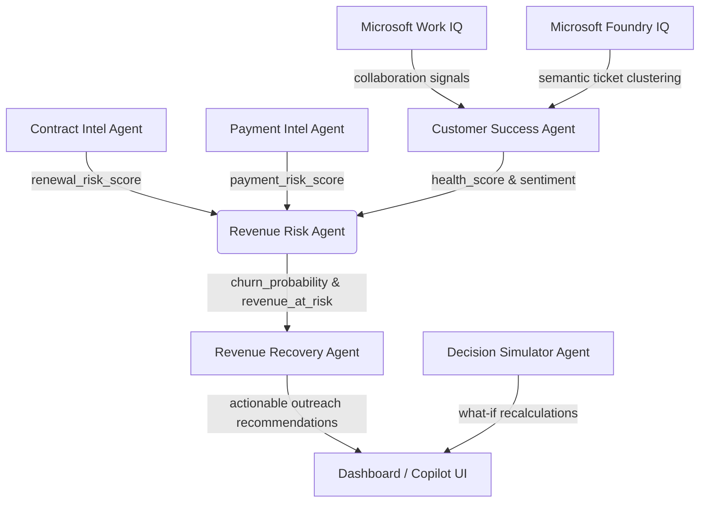

# ReviveIQ – AI Revenue Recovery Agent for Microsoft 365 Copilot

ReviveIQ is an enterprise-grade multi-agent AI decision intelligence platform designed to proactively identify and mitigate corporate revenue risks. Built for Microsoft Enterprise Agents Hackathons, it highlights deep integration with Microsoft 365 Copilot extensibility interfaces, utilizing first-class adapters for Microsoft Work IQ, Foundry IQ, and Graph abstractions.

<video src="https://github.com/rishabh-108272/RevivelIQ/blob/main/user-attachments/assets/demo.mp4" controls="controls" style="max-width: 100%;">
</video>

---

## Core Business Problem

Enterprise organizations leak revenue due to operational disconnects:
- **Invoice delays** go unnoticed, leading to working capital issues.
- **Contract renewals** expire without proactive engagement.
- **Support backlogs** go unresolved, degrading client trust.
- **Negative sentiment** builds silently across emails and sync meetings.

ReviveIQ connects these variables, evaluates risk priorities in real-time, generates explainable reasons, triggers recovery outreach term sheets, and simulates what-if recovery options for account leads.

---

## Architectural & Agent Workflow

### Multi-Agent Pipeline
The system integrates six specialized, cooperative intelligence agents:



1. **Contract Intelligence Agent**: Predicts renewal likelihood based on expiration timelines.
2. **Payment Intelligence Agent**: Monitors aging invoices and projects billing delays.
3. **Customer Success Agent**: Evaluates client emails, ticket queues, and meeting sentiments. Integrates Work IQ collaboration patterns and Foundry IQ semantic ticket clustering.
4. **Revenue Risk Agent**: Synthesizes upstream inputs to compute churn probability, risk category, and exposed revenue.
5. **Revenue Recovery Agent**: Formulates prioritized outreach tasks, computing Gross protected revenue, execution costs, and Net Recovery values.
6. **Decision Simulator Agent**: Calculates in-memory adjustments for what-if scenarios (e.g. resolving tickets or adjusting renewal discounts).

---

## Microsoft 365 Copilot Compatibility

The application is structured to compile as a native Copilot declarative agent:
- **Work IQ Adapter**: Evaluates relationship communication touchpoints and response latency trends.
- **Foundry IQ Adapter**: Provides semantic indexing and pgvector cosine search.
- **Graph Abstractions**: Mock/Azure AD token endpoints reading calendar events and email feeds.
- **Declarative Agent Manifest (`copilot/manifest.json`)**: Configures Copilot's system prompt instructions and scopes.
- **OpenAPI Schema (`copilot/openapi.yaml`)**: Maps secure REST paths for Copilot chat queries.
- **Adaptive Cards Renderer**: Returns responses formatted as interactive Adaptive Cards v1.5.

---

## Local Installation Guide

### Prerequisites
- Python 3.11+
- Node.js v20+ & npm
- Docker Desktop with Compose support
- PostgreSQL database (if running outside Docker)

### Run via Docker Compose (Recommended)
This boots up the complete containerized stack, including the `pgvector` pre-configured database, Redis queue caches, Celery workers, FastAPI server, and Vite client:

```bash
# Clone the repository and navigate to the directory
cd ReviveIQ

# Spin up containers
docker-compose up --build
```
Once healthy, access:
- **Frontend Dashboard**: `http://localhost:3000`
- **FastAPI Documentation (Swagger)**: `http://localhost:8000/docs`

*Note: On first launch, the backend automatically seeds 100 mock customer accounts, 500 invoices, 100 contracts, 1000 interactions, and 500 support tickets, then runs the orchestrator pipeline to populate the dashboard metrics immediately.*

### Running Manually (Local Development)

#### 1. Backend Setup
```bash
cd backend
python -m venv venv
source venv/Scripts/activate  # On Windows: venv\Scripts\activate

# Install requirements
pip install -r requirements.txt

# Run Database initialization & seeding (Ensure PostgreSQL is running on port 5432)
# Ensure your environment variables are configured in a .env file
python app/utils/seed.py

# Launch server
uvicorn app.main:app --reload --port 8000
```

#### 2. Frontend Setup
```bash
cd ../frontend
npm install
npm run dev
```
Navigate to `http://localhost:3000` to interact with the interface.

---

## Developer/Hackathon Quick Login Bypass & Onboarding

### 1. Instant Hackathon Access (One-Click Bypass)
For quick evaluation without executing registration or typing passwords, the login page features an **"Instant Access Bypass"** button at the top:
- Clicking this sets a local session and authorizes requests using a dedicated `hackathon-bypass-token`.
- The backend recognizes this token, bypasses JWT validation, and automatically maps the session to the default **System Admin** user account.

### 2. Multi-Tenant Role-based Bypass Selectors
Alternatively, the login page hosts quick-bypass buttons to switch scopes instantly:
- **System Admin** (`admin@reviveiq.com` / `admin123`): Full dashboard controls, manual DB reseed triggers.
- **Customer Success Lead** (`cs@reviveiq.com` / `cs123`): Ticket clustering analysis, support escalations approval.
- **Finance Lead** (`finance@reviveiq.com` / `finance123`): Receivable overdue charts, collection outreach approvals.
- **Sales Lead** (`sales@reviveiq.com` / `sales123`): Expiration dates tracker, rate discount approvals.

### 3. User Signup & Dynamic Environment Seeding
To register a brand-new tenant:
1. Toggle the login screen to **"Create one"**.
2. Register a new name, email, password, and custom organization.
3. Upon signup, the backend triggers an **asynchronous seeding task** (using FastAPI's `BackgroundTasks`) to populate the new tenant with a realistic synthetic portfolio of 100 customers, 500 invoices, 100 contracts, 1000 communications, and 500 tickets, then runs the multi-agent assessment sync.
4. The user is redirected to sign in immediately, with their metrics fully populating in the background.

---

## Production Deployment Guide

### Deploying to Azure Container Apps (ACA)
1. **Azure Container Registry**: Build and push backend and frontend Docker images to Azure Container Registry (ACR).
2. **PostgreSQL on Azure**: Set up Azure Database for PostgreSQL (Flexible Server) and enable the `vector` extension.
3. **Azure Container Apps**: Provision two Container Apps (backend, frontend) and configure env keys (`DATABASE_URL`, `SECRET_KEY`).
4. **Redis cache**: Deploy Azure Cache for Redis and configure Celery.

---

## 💼 Hackathon Submission Details (Microsoft Agents League 2026)

### Target Tracks
- 💼 **Enterprise Agents Track (Primary)**
- 💡 **Best Use of IQ Tools Track (Secondary)**

### IQ Integration Map

| Feature | IQ Layer | Role |
|---|---|---|
| Ticket clustering & risk evidence | **Foundry IQ** | Grounded retrieval from enterprise knowledge sources with source citations |
| Communications feed & relationship routing | **Work IQ** | Memory from emails, meetings, Teams chats; infers decision authority |
| Revenue projections & margin enforcement | **Fabric IQ** | Semantic reasoning over ARR, renewal cohorts, margin floors |
| AI Explainability Panel | **Foundry IQ** | Citation chain showing which document triggered each risk flag |
| Org Simulator contacts | **Work IQ** | Relationship graph from real communication patterns |
| What-If Simulator constraints | **Fabric IQ** | Business logic (approval thresholds) from Fabric semantic model |

### Agent Pipeline
The 6-agent sequential orchestration pipeline has explicit dependency ordering: 
```
Contract Agent ➔ Payment Agent ➔ CS Agent (Foundry IQ) ➔ Revenue Risk Agent ➔ Recovery Agent ➔ Executive Briefing Agent (Work IQ)
```

### Safety Design
- **SafetyGuard Gate**: All discount deployments > 20% require manual approval and are blocked with alert notifications.
- **Sandboxed Simulator**: The What-If Simulator runs in a read-only sandboxed mode, never writing to the database until user explicitly signs off.
- **Citation Provenance**: Every risk flag includes a Foundry IQ citation chain showing the source document name and excerpt.
- **Safe Testing**: `dry_run: true` toggle parameter is available on all agent orchestration pipeline calls.
